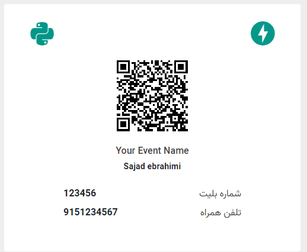
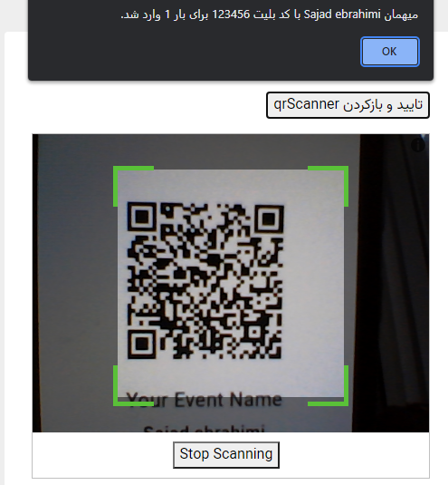

# QR Code Ticket

This service generates a unique qr code for each registered user and also provides a qr reader for the receptionist to
verify each ticket powered by Fastapi

## Screenshot

| Ticket                | Qr scanner                    |
|-----------------------|-------------------------------|
|  |  | 

## Getting Started

Clone repository

```bash
git clone https://github.com/sadjadeb/qrCode_ticket.git
```

### Prerequisite

Create an environment to run the app

```bash
cd qrCode_ticket/
sudo apt-get install virtualenv
virtualenv venv
source venv/bin/activate
cd src/
```

Install required libraries

```bash
pip install -r requirements.txt
```

\
**Don't forget to rename sample_config to config and replace mock data with valid ones**

Your Excel file must be formatted as follows:

| first_name | last_name | phone_number |
|------------|-----------|--------------|
| Sajad      | Ebrahimi  | 09151111111  |
| Alireza    | Hooshyar  | 09152222222  |
| ...        | ...       | ...          |

Run the following command to add ticket ids and links for registered users

```bash
python main.py generate_ticket_link
```

After that you have an Excel file named `output.xlsx` at the OUTPUT_FILE_PATH formatted as follows:

| first_name | last_name | phone_number | ticket_id | ticket_link |
|------------|-----------|--------------|-----------|-------------|
| Sajad      | Ebrahimi  | 09151111111  | 165153    | https://... |
| Alireza    | Hooshyar  | 09152222222  | 895232    | https://... |
| ...        | ...       | ...          | ...       | ...         |

For easy sharing of the links, they stored in a separate column named `ticket_link`

#### config Nginx to serve the ticket links
```bash
sudo nano /etc/nginx/sites-enabled/ticket
```

then paste the following:
```
server {
    server_name <DOMAIN_NAME>;
    
    location / {
        proxy_pass http://localhost:8000;
    }
}
```


## Run

Run the following command to start the webserver

```bash
python main.py run_webserver
```

#### User
Open the base_url/ticket/ticket_id to see the ticket

#### Receptionist
For the receptionist, get the /reception endpoint and enter the password to open the QR code reader and verify the
ticket

#### root path
Put your event's poster in /templates/static/img/poster.jpg

Open the base_url/ to see the poster

#### 

## Contributing

Pull requests are welcome. For major changes, please open an issue first to discuss what you would like to change.

Give a ⭐️ if you like this project!

## License

[MIT](https://github.com/sadjadeb/qrCode_ticket/blob/master/LICENSE)